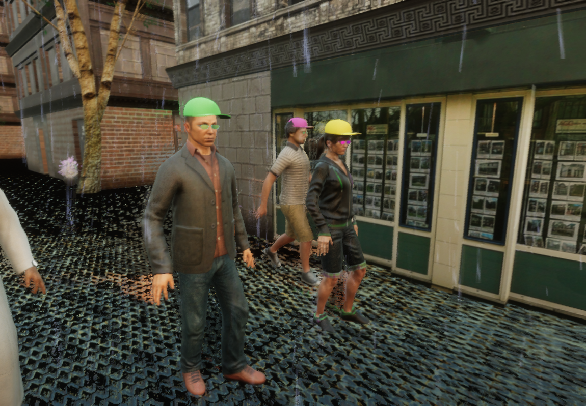
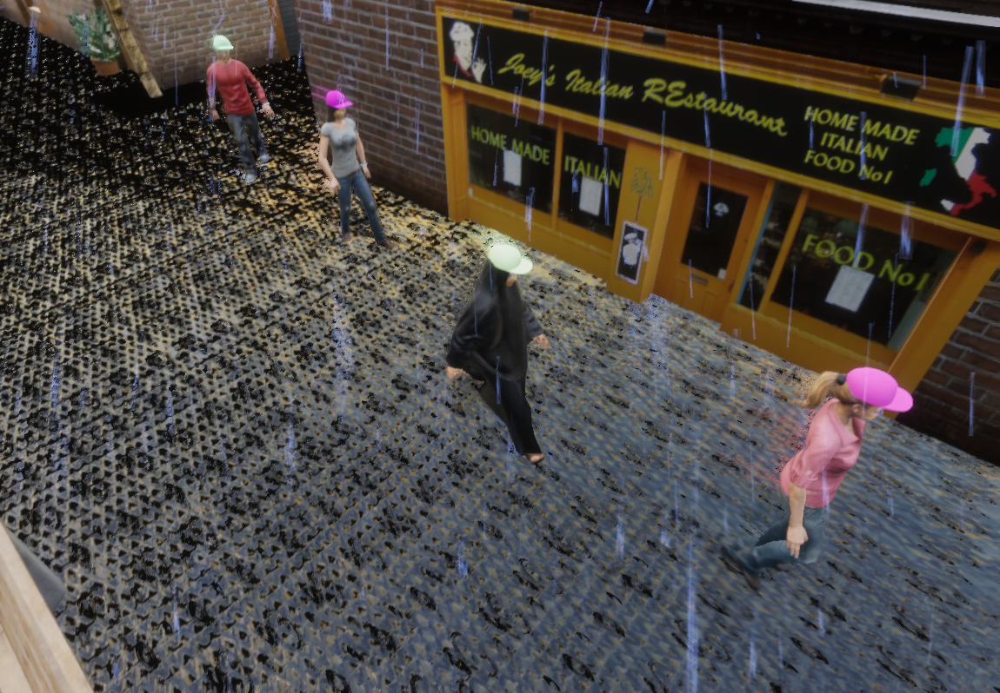

# Silver: Novel Rendering Engine for Data Hungry Computer Vision Tasks

 

 
 
To Watch the Full Video: (https://youtu.be/Ktlx5bgJLXE)
 
## Abstract
In this work, a new rendering engine called **Silver** is presented in details. The full-system code was released with a sample dataset. The dataset is just meant to show the capability of the system and researchers are welcomed to generate their own datasets.
## System Requirements
To run the system smoothly on your device, the following are suggested:
* Ubuntu 18.04.5 LTS.
* Unity HDRP (Unity version 2020.1.17f1).
* GeForce GTX 1080 Ti
* Vulkan API

## System Features
### Ground-truths
Our system automatically provides ground-truth for depth estimation, normal map, semantic segmentation, instance segmentation and body pose estimation.Image below shows one RGB frame with its corresponding ground-truths for the mentioned computer vision tasks. In addition to other textual information describing the time of the day, the weather condition, and many other useful information.

  

### Photo-realism
HDRP is based on the Scriptable Rendering Pipeline (SRP). Generally, it is intended for high visual fidelity applications. The other key feature of HDRP is the Physical Light Unit (PLU) that relies on real-life lighting measurable values. All of these attributes together contribute to the final photo-realistic rendering shown below.

  

### Diversity
 To avoid the over-fitting to the visual features of the synthetic world, the content of the environment is diversified by including a wide set of 3D models, textures, animations, weather conditions, illumination and lighting, and recording set-ups. Examples frames from the supported weather conditions and time of days are shown below. 

 

## Code and Dataset
* The complete project can be downloaded using this link: [Click](https://livelancsac-my.sharepoint.com/:u:/g/personal/kerim_lancaster_ac_uk/EX7jGWteToRJu2GP21bx3g8Blpk61RPTyw0vlBvNFzp-QQ?e=4ac5RI)
* The sample dataset can be downloaded using this link: [Click](https://livelancsac-my.sharepoint.com/:u:/g/personal/kerim_lancaster_ac_uk/ERMsh_Ba7TFPhCTXNejU4DABDY_mmG4UmAgrnt3qsdRL1Q?e=3kgZFI) 

## Sample Videos
To see a long video, please click on the images below.
    

## Contact Authors
* Abdulrahman Kerim, PhD Student, at Lancaster University, a.kerim@lancaster.ac.uk
* Leandro Soriano Marcolino, Lecturer at Lancaster University, l.marcolino@lancaster.ac.uk
## Licence
* The Dataset and the framework are made freely available to academic and non-commercial purposes. They are provided “AS IS” without any warranty.   
* If you use the dataset or the framework feel free to cite our work.
## Paper
* Paper is currently under review, once published the link will be provided here!
